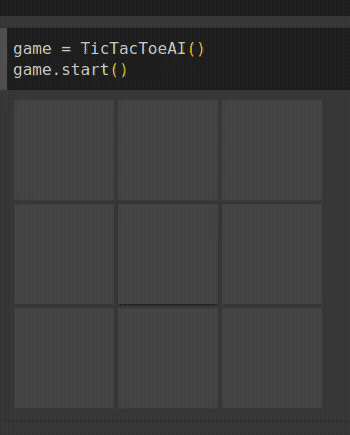
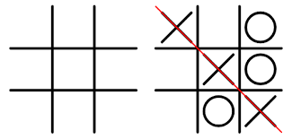
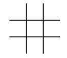
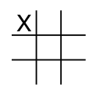
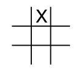
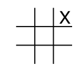
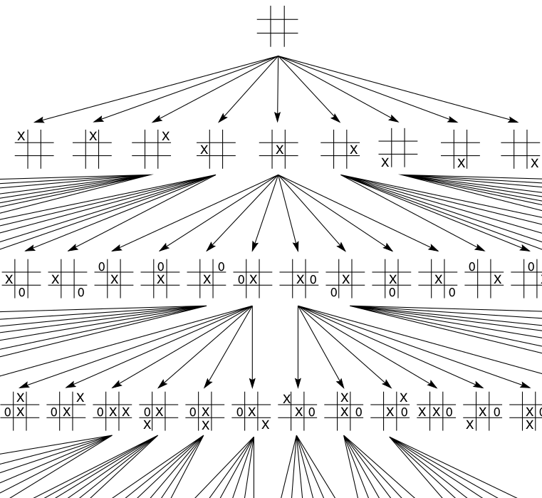
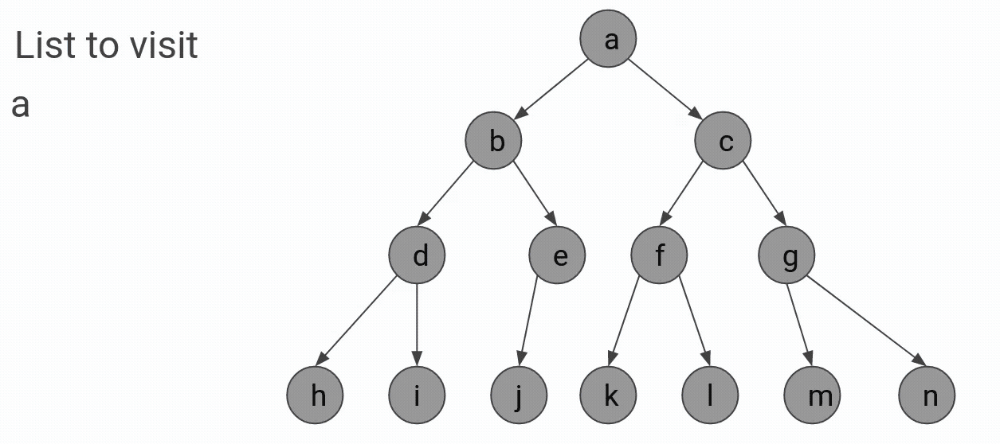
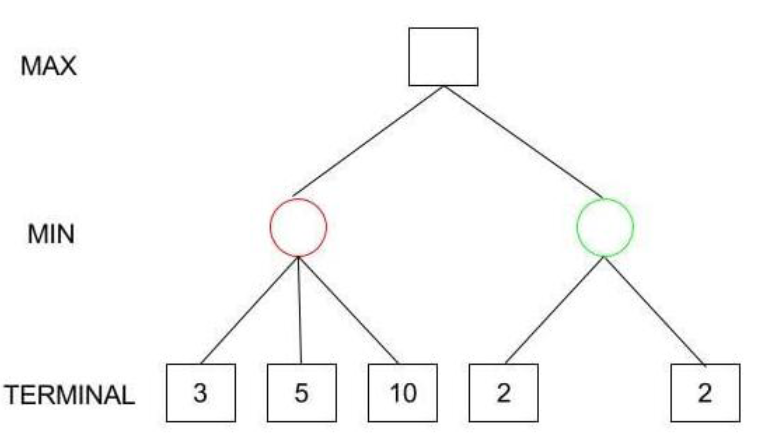
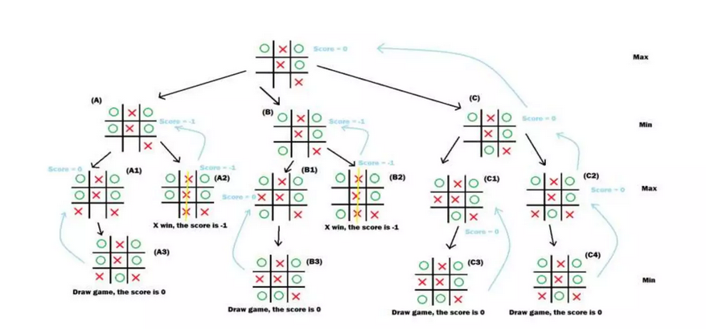

# Tic-Tac-Toe-AI
Minimal implementation of Tic Tac Toe AI using MiniMax algorithm with interface used to teach AI concepts

## Tic Tac Toe
 - Competition between 2 players
 - Each player chooses one of the X and O symbols
 - The first player draws an X in any of the 9 positions on the grid
 - The second player draws the O symbol in an empty position
 - Both players draw their symbols alternately
 - Any player wins if he completes a row, column or diagonal with his symbol

## State
- Its like a picture of the moment
- Enough to say what the next state will be given an input

There are here some example of states in Tic Tac Toe Game:

   

### State Space
The state space cover all possible states and its transitions given an action:

## Depth-first search - DFS
Depth-first search is strategy to search in state space. In this technique one first explore depth as shown in the gif below

## MiniMax algorithm
MiniMax is an algorithm that try to maximize the own reward assuming that the enemy will try to do the same.

